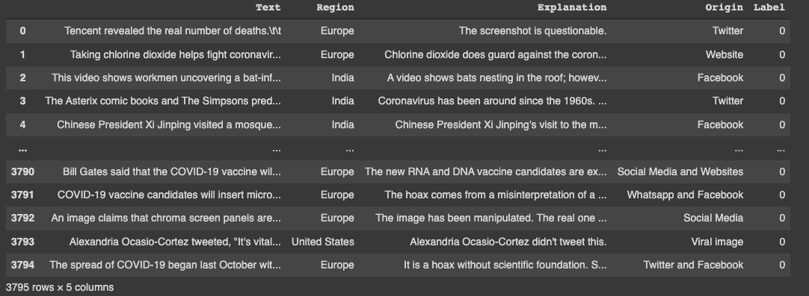
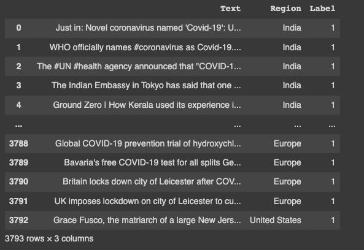
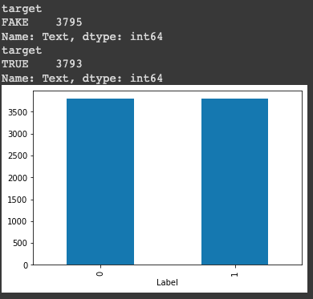

# COVID-19 Fake News

Collaborative Machine Learning project: Using modeling techniques to determine the legitimacy of a new source.

# Background

The outbreak of the novel coronavirus (COVID-19) has been accompanied by a large number of misleading and false information about the virus,especially through social media . The same technology we rely on to stay informed,productive and connected is enabling and amplifying fake news that continue to undermine the global health response and jeopardizes measures to control the pandemic. In fact, the spread of misleading information about the virus has led the World Health Organization to warn of an on-going "infodemic" or an overabundance of information, both online and offline. 

Misinformation cost lives. Without the appropriate trust and correct information, diagnostic test go unused,immunization campaigns to promote effective vaccines will not meet their targets,and the virus will continue to thrive.

# Setup
This project aims to develop a method for detecting and classifying COVID-19 fake news stories using Natural Language Processing.
We have used a Google colab notebook. The following packages are involved:
* spaCy is a high-performance NLP library for production use.
* scikit-learn: helpful package for data analysis and machine learning.
* matplotlib.pyplot: a typical package for data visualisation in Python.
* Pandas is a Python data analysis and manipulation tool that is widespread, flexible, and simple to use.


# Data
The dataset consist of two csv file, Fake and true news. 

Fake News


Real News



# EDA

Before training our models, we accomplished some exploratory data analysis (EDA) to understand the shape and make-up of our data.

```python
# How many fake and real articles?
print(fake.groupby(['target'])['Text'].count())
print(true.groupby(['target'])['Text'].count())
News.groupby(['Label'])['Text'].count().plot(kind="bar")
plt.show()
```


